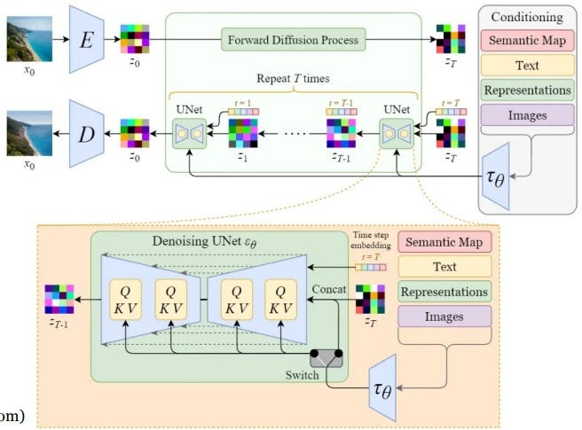

# Stable Diffusion from Scratch

A PyTorch implementation of Stable Diffusion built from first principles, with mathematical explanations, architecture diagrams, and step-by-step implementations of diffusion models.

## Architecture



## Overview

This project explores how modern diffusion models generate images through iterative denoising in a compressed latent space. The repository covers:

- Forward and reverse diffusion
- Denoising U-Net
- Variational Autoencoders (VAE)
- Latent Diffusion Models (LDM)
- Text conditioning and cross-attention
- Classifier-Free Guidance (CFG)
- Text-to-Image generation
- Image-to-Image generation
- Inpainting

## Project Goals

- Understand diffusion models mathematically
- Implement Stable Diffusion components from scratch
- Build clean, research-grade PyTorch code
- Visualize the complete generation pipeline
- Reproduce core ideas behind modern generative AI systems

## Repository Structure

```text
src/
├── diffusion/
├── models/
├── data/
├── training/
├── inference/
└── utils/
```

## Roadmap

- [ ] DDPM from scratch
- [ ] U-Net implementation
- [ ] VAE encoder/decoder
- [ ] Latent Diffusion Model
- [ ] Text conditioning
- [ ] Classifier-Free Guidance
- [ ] Text-to-Image
- [ ] Image-to-Image
- [ ] Inpainting
- [ ] Training on custom datasets

## Tech Stack

- Python
- PyTorch
- NumPy
- OpenCV
- Hugging Face Transformers
- Matplotlib

## Author

Anthony (Ocheme) Ekle  
PhD Candidate, Tennessee Technological University